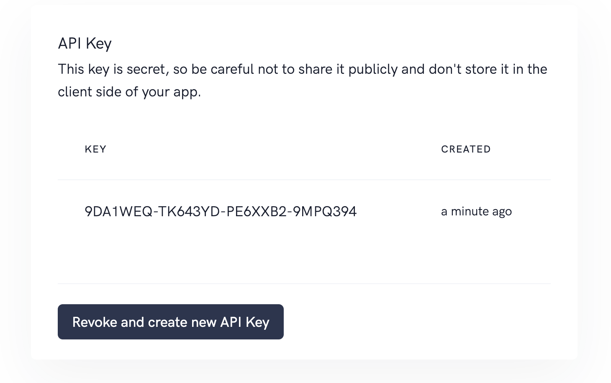

# Authentication

API requests must be authenticated by using your API key. Your API key is listed under `Integration`, you can find it in the menu. This key is secret, so be careful not to share it publicly and don't store it in the client side of your app. You can include your secret API key in a request by adding it as a POST parameter with key apiKey.

## Authenticate

You can include your secret API key in a request by adding it as a POST parameter `apikey`.

```bash
curl https://api.ioannotator.com/api/endpoint?apikey=YOUR_API_KEY
```

## API Key

We assigned you a randomly generated API key ready for your integration. In case you disposed your API key you can create a new one with `Revoke and create new API key`. Please be aware as soon as you create a new one your old one cannot be used anymore.



