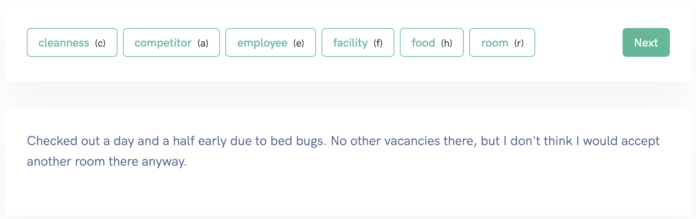

# Annotate

The annotator is your main tool to annotate your data in a fast way. 
We optimized our annotator to reduce distraction by keeping the interface to a minimum.

* The **labels** are displayed in the upper row.
* You can navigate to the next text either by clicking **Next**
 in the upper right corner. Or using the shortcut `enter`.
* Labels can be selected by using the corresponding shortcuts in our example `r` for room. You can define the shortcuts on your own.

## Annotator
### Classification Annotator

The Classification Annotator is used to annotate the complete text with one or multiple labels. 

### Named Entity Recognition Annotator
The Named Entity Recognition Annotator is used to annotate one or multiple entity within the text. 

### Sequence to Sequence Annotator