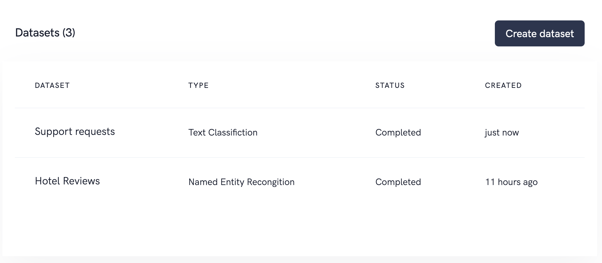

# Datasets

A dataset is the parent of your data and contains everything related to your data. I

The dataset overview shows all of your datasets ordered by creation date. If you are new your dataset list is empty.

The annotation type depends on which sort of machine learning problem you want to solve.

## Create dataset
A dataset consists of a name, type and optional a description.
We currently support two types of datasets `Text Classifications` and `Named Entity Recognition`

## Dataset details
Each dataset has a detail page where you can find all features related to a dataset: 

* [Manage label](./labels.html)
* [Import data](./import.html)
* [Start annotating](./annotate.html)
* [Review annotations](./review.html)
* [Export data](./export.html)
* [Metrics](./metrics.html)

## Delete dataset
If you want to delete a dataset please keep in mind this process cannot be reverted, your data will be lost. A dataset can be deleted by navigating to the detail page and click on delete, confirm with the word `DELETE`. The dataset is then scheduled for deletion and will be deleted in the next 15 minutes. 

