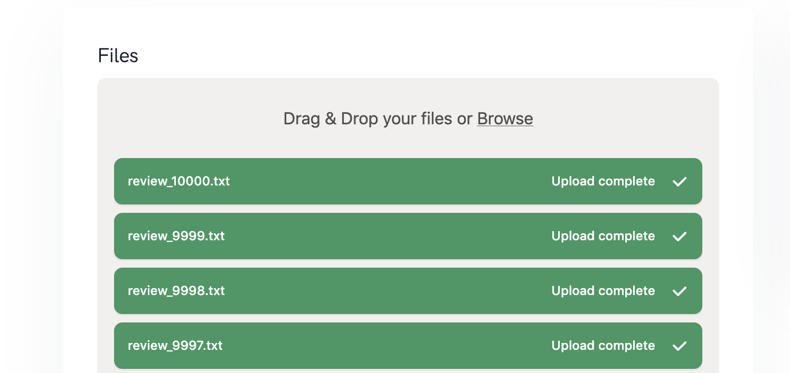

# Import

You can upload data in 2 ways, which one you choose depends on your use case and your background:

1. Use the **API** if your dataset is continously growing and you constantly have to import new data. The API provies a seamless integration into your machine learning pipelines.
1. Use the **User Interface** if you annotate a dataset which more or less fix and rather small. 

## API (recommended)
Please see the dedicated [API documentation](../api/introduction.html). 

## User Interface
The UI provides a limited way to upload files up so several hundret files. If you have more files we recommend to use the API. To upload files use `browse` or `drop` your files. We currently support `.txt` files.

