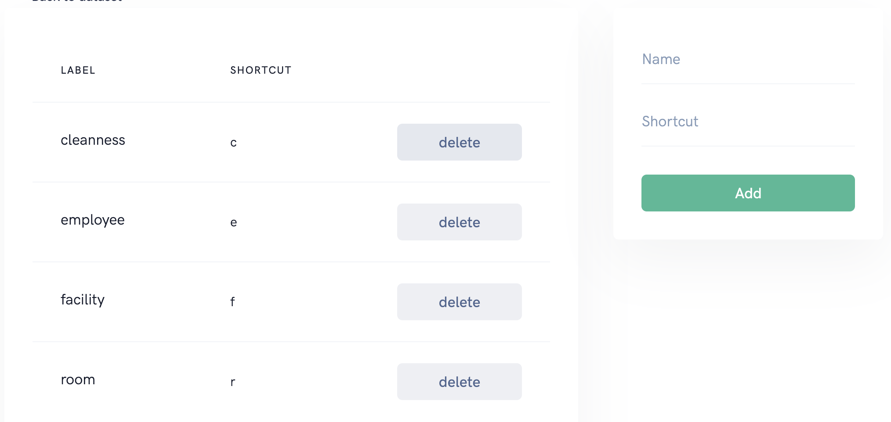

# Label

Label are used to annotate your data. 

## Add labels
Labels are related to a dataset, you can ad as many labels as needed for your use case. Labels are assigned with shortcuts which are useful if you want to speedup your annotation process.

## Remove labels
Though you can remove labels at any time please keep in mind already annotated data will not be updated. 