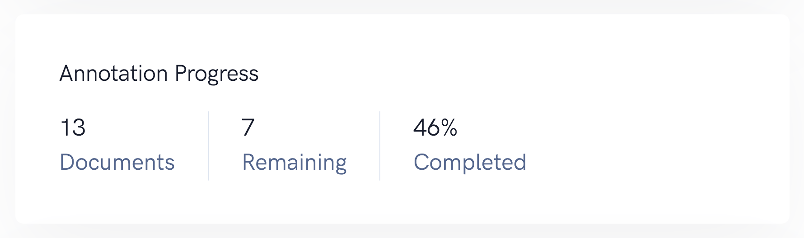
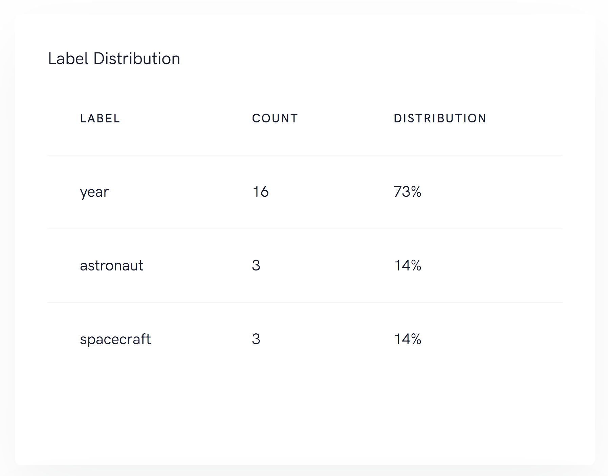
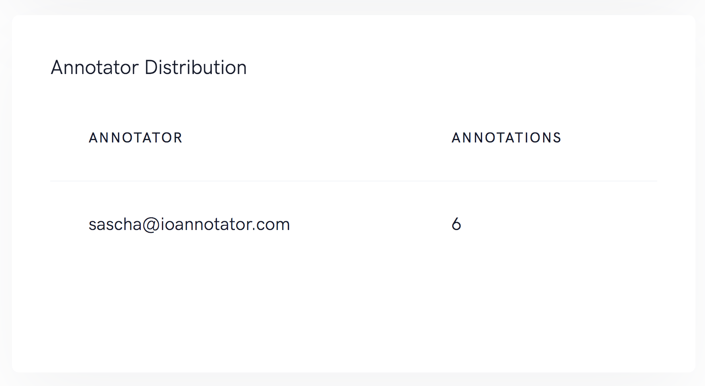

# Metrics <Badge text="more metrics soon" type="warn"/>

## Annotation Progress
This metric can be used to get a quick overview of the annotation progress. The number of uploaded documents and the number of annotated documents will be set in relation.

## Label Distribution

A useful metric to see the distribution of each label in the dataset. Great to understand if the model has enough labeled data and if the training might be biased.

## Annotator Distribution

Annotation teams can be hard to follow if there is no overview of each annotator. We support annotation distribution which helps to get an understanding of your annotation team.

::: tip
Please be aware annotation speed does not necessarily result in high-quality datasets. This metric can not be used to measure performance, it just indicates the progress. Some documents are hard to annotate others are easy.
:::

