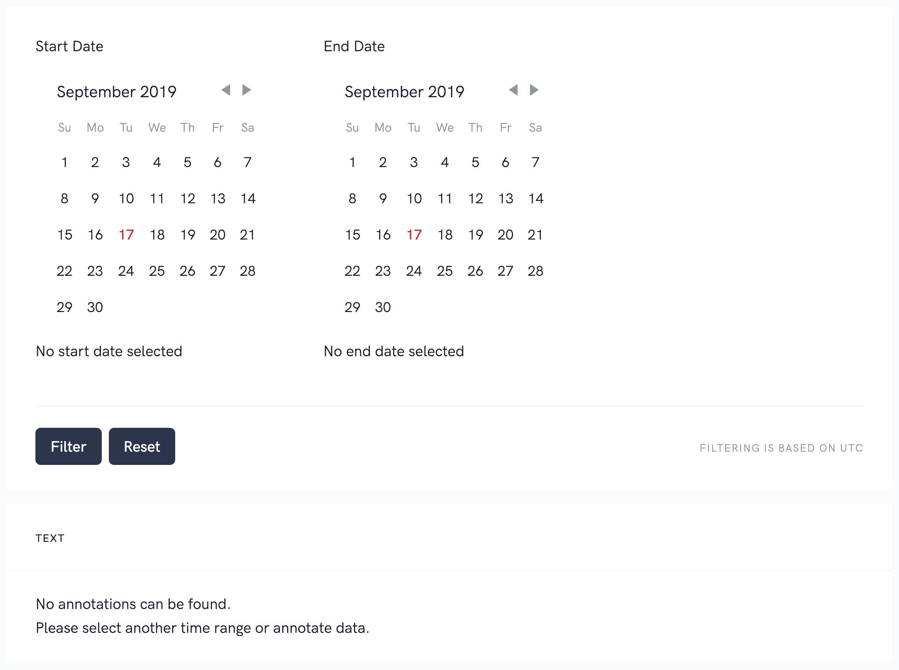
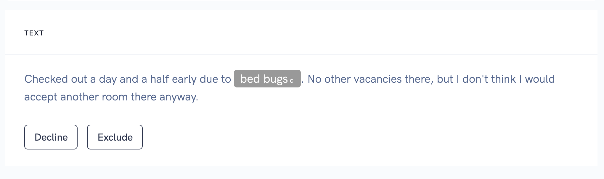

# Review

Review can increase the quality of your dataset. This step is optional and depends on your ressources and the type of your data. 

## Review filtering
The review interfaces provides several actions that can be used 
* Filter based on `startdate` (show  all annotations from this start date to today).
* Filter based on `enddate` (show all annotations from the beginning of time till this end date)
* Filter based on `startdate` and `enddate` (show me all annotations between start and end)

> Please keep in mind the filtering is based on UTC time.

## Review actions

For each text you can choose between two actions 
* `decline` which moves the text again into the annotation process. It will be marked as declined to show the annotator it failed the review.
* `exclude` in case the text should not be used anymore, it will then not be used during export and is not displayed in the annotator anymore.

