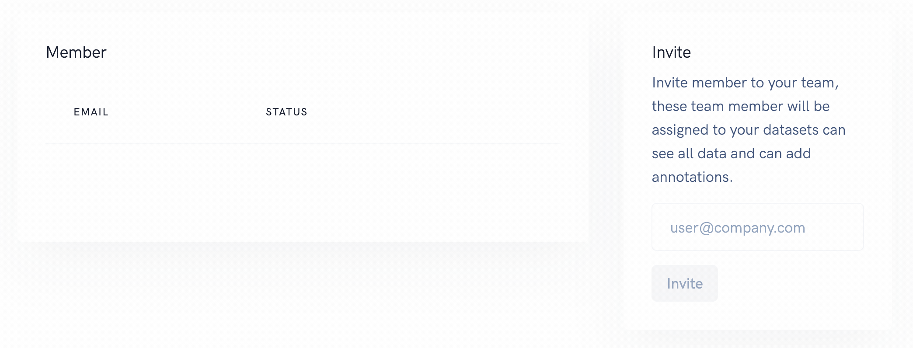
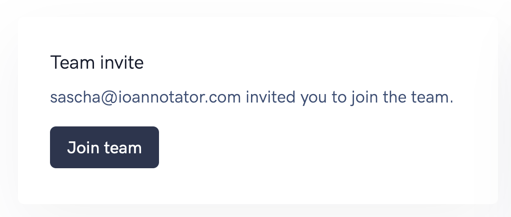

# Team

To annotate together with your team you can invite team members. There is no limit on how many team members you can invite. 

::: tip
Your team members can not invite or remove other team members.
:::

## Invite member

Go to team and invite your team member by typing their email adress and click invite.

## Remove invite
If your don't longer want to invite a team member you can remove the invitation.

## Remove member
It is also possible to remove team member, the user will not longer have access to the datasets.

## Accept invite
Your team members will see the invite and can accept it. 

## Multi user annotation

We support multi-user annotation to speed up your annotation process.
Each document is assigned to one annotator, in other words the work is distributed.

This is a fully automatic process simply start annotating.