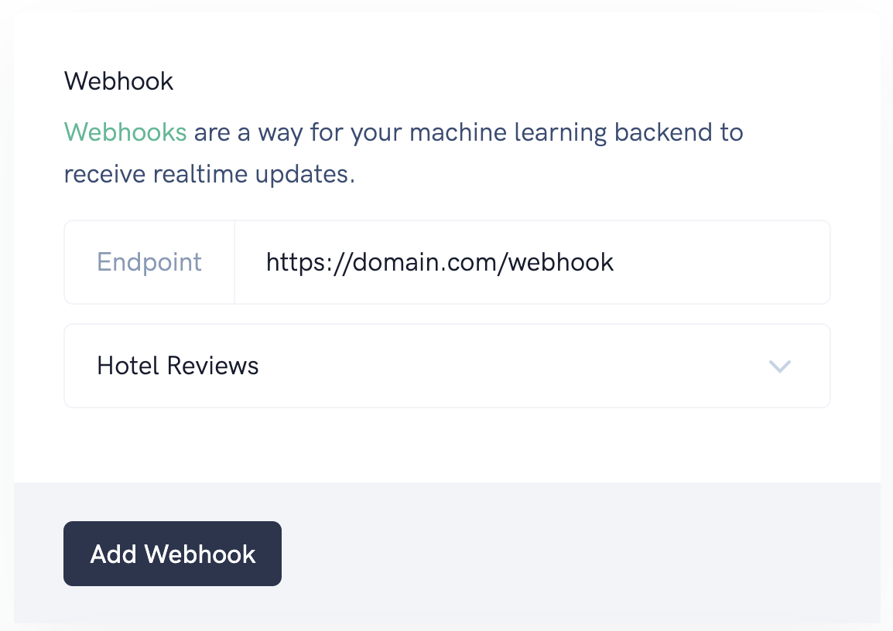
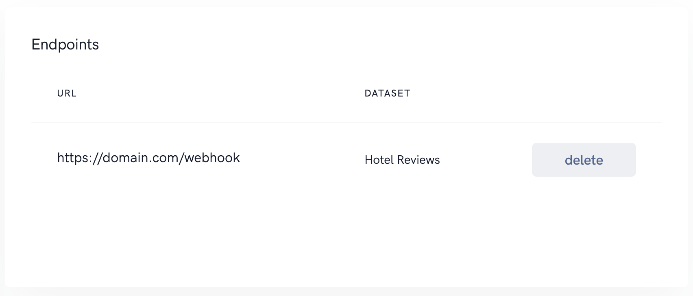

# Webhooks

Webhooks are a way for your machine learning backend to receive realtime updates.
Webhooks will be trigger each time a document's annotations is done. 

## Add webhook
Webhooks can be added by navigating to `Integrations -> Webhooks`. You can add multiple webhooks for each dataset. Webhooks will send each annotation seperated to your API endpoint.



### Sample webhook 

```
POST

{
   "dataset":"5720477930618880",
   "annotation":{
      "entities":[
         {
            "end":4,
            "start":0,
            "label":"year"
         }
      ],
      "text":"1813 First exposition of the rocket equation based on Newton's third law of motion: Treatise on the Motion of Rockets"
   }
}
```


## List webhooks
On the same page we provide a overview of all webhooks for all datasets. If you want to remove a webhook just click `delete`.

